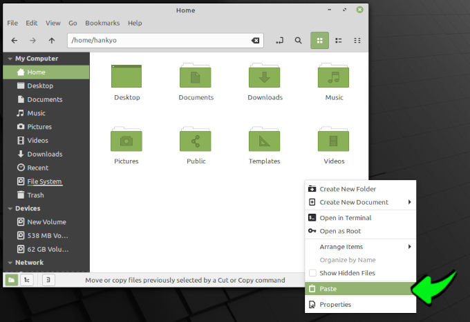
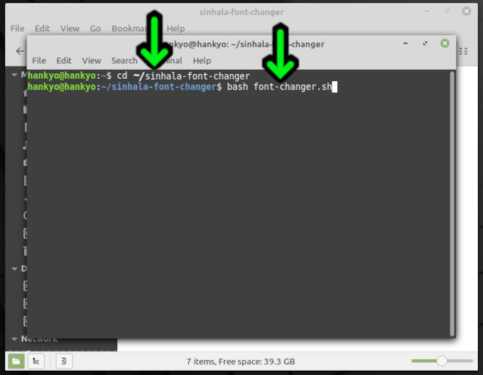
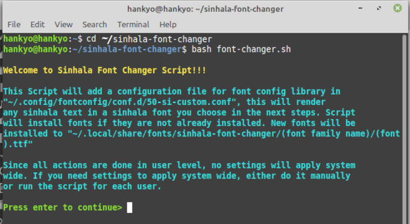
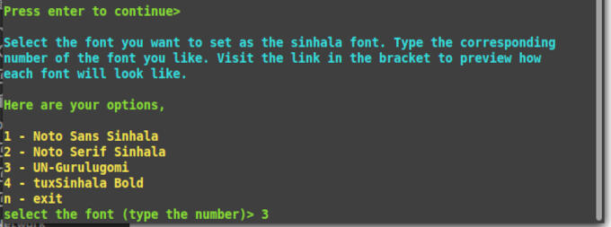
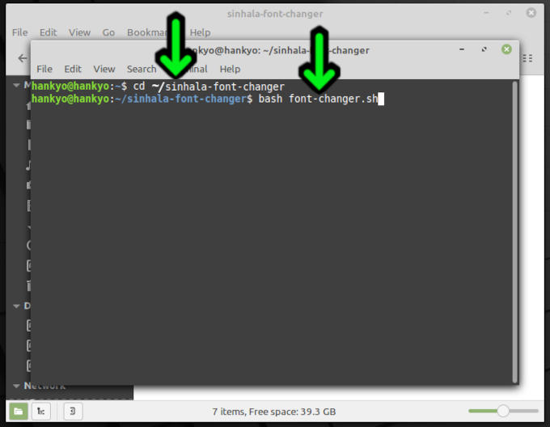

# Linux System Sinhala Font Changer


මෙම මෘදුකාංගයෙන් ඔබට කියවීමට පහසු සිංහල අකුරු සහිත, අලංකාර සිංහල font එකක් ඔබගේ linux computer 
එකෙහි display කිරීම සිදුකරයි,
 

 
### භාවිත කලහැකි Linux මෙහෙයුම් පද්ධති:

+ Ubuntu,linux mint,fedora වැනි සෑම linux මෙහෙයුම් පද්ධතියකම මෙම මෘදුකාංගය භාවිත කල හැක.
 
# භාවිතය

## Install කරන ආකාරය:

1. පලමුව මෙම link එක මගින් මෙම මෘදුකාංගය download කරගන්න: 
[sinhala-font-changer.zip](https://github.com/hankyoTutorials/linux-system-sinhala-font-changer/releases/download/v2.0/sinhala-font-changer.zip)

1. ඉන්පසු එම zip එක extract කරගන්න: 


1. මීලගට එම "sinhala-font-changer" folder එක cut කර ඔබගේ home folder එකට paste කරන්න: 
 


## භාවිත කරන ආකාරය:

1. linux terminal එකෙහි මෙම command 2ක type කිරීමෙන් මෙම මෘදුකාංගය open කරගතහැකිය:
    
    ```
    cd ~/sinhala-font-changer
    bash font-changer.sh
    ```

    

1. මෙහිදී "Enter" key එක press කරන්න:


1. මෙහි ඇති සිංහල font අතරින් ඔබට කැමති සිංහල font එකට අදාල අකුර type කර enter කරන්න:


1. Complete!, ඉන්පසු සිංහල font එක වෙනස් වී ඇත්දැයි පරික්ෂා කර බලන්න


1. නැවතත් වෙනත් සිංහල font එකකට මාරුවීමට කැමතිනම් මෙම command 2ක type කර යලි මෙම මෘදුකාංගය 
open කරගතහැකිය:

    ```
    cd ~/sinhala-font-changer
    bash font-changer.sh
    ```

    

### මෙම මෘදුකාංගය නිර්මාණය කරඇති ආකාරය:

මෙහිදී `fontconfig` library එක හරහා සිංහල Unicode අකුරු සඳහා සිංහල font එකක් ආදේශනය කළ යුතු බව 
විශේෂයෙන් මෙහෙයුම් පද්ධතියට අවධාරණය කරයි, මේ සඳහා සැකසිය යුතු `fontconfig` configuration file 
සම්බන්ධයෙන් Arch Wiki හි පහත ලිපි වල විස්තරාත්මකව තතු ඉදිරිපත් කර ඇත.

+ [Font_configuration](https://wiki.archlinux.org/title/Font_configuration)
+ [Font_configuration/Examples](https://wiki.archlinux.org/title/Font_configuration/Examples)

## උපකාර

* [Github Issue](https://github.com/hankyoTutorials/linux-system-sinhala-font-changer/issues) එකක් 
open කිරීමෙන් උපකාර ලබා ගත හැකිය. 

Contact Adeepa: slrootkit@gmail.com (https://slrootkit.blogspot.com)<br/>
Contact Hankyo: hankyomail@gmail.com
